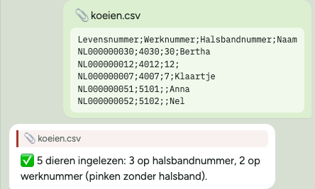
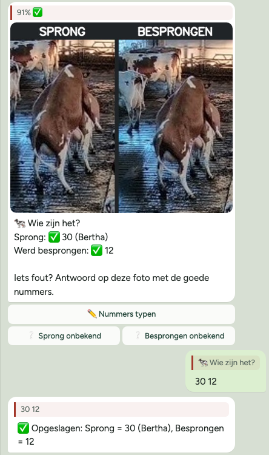
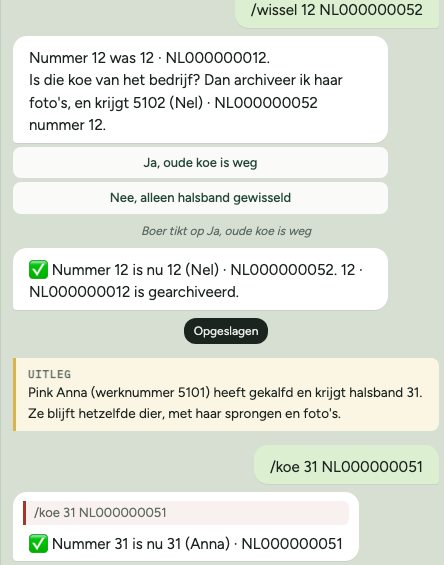
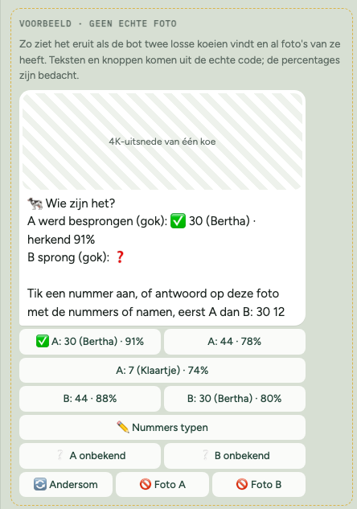
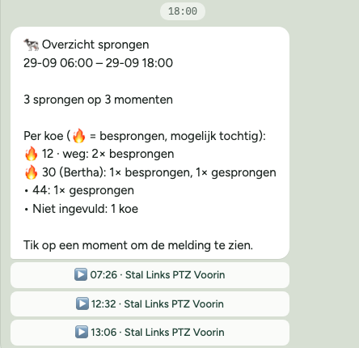

# CowCatcher AI Detector

Deze fork draait CowCatcher op een Mac mini, verstuurt detecties via Telegram en
verzamelt gecontroleerde voorbeelden om het YOLO-model verder te trainen.

## Installeren en automatisch bijwerken

Op de Mac mini installeer je CowCatcher één keer. Daarna draaien de detector en de
web-interface als achtergrondservice: ze starten vanzelf na een herstart van de Mac, starten
opnieuw na een crash en werken zichzelf bij zodra er een nieuwe release is. Er hoeft geen
Terminal-venster meer open te blijven.

Open Terminal op de Mac mini en voer uit:

```bash
curl -fsSLo cowcatcher.sh https://raw.githubusercontent.com/StefHarmens/ai-detector/main/macos/cowcatcher.sh
bash cowcatcher.sh install
```

De installatie:

- stopt een CowCatcher die nog los in Terminal draait (na bevestiging);
- verhuist `CowCatcher - Custom` van het Bureaublad naar `~/CowCatcher`, samen met wat
  `config.json` op het Bureaublad gebruikt (`data`, `video`, `koeienlijst.xlsx`), en past de
  paden in `config.json` aan. Het origineel blijft bewaard als `config.json.voor-installatie`.
  macOS laat een achtergrondservice niet zomaar in het Bureaublad lezen, daarom de verhuizing.
  Op het Bureaublad komt een snelkoppeling `CowCatcher`;
- downloadt de nieuwste detector en web-interface en start ze.

Staat de oude map ergens anders, geef hem dan op met `--from "<map>"`. Zet daarna in
Systeeminstellingen > Gebruikers en groepen **automatisch inloggen** aan voor de gebruiker
`cowcatcher`, anders start CowCatcher na een stroomstoring pas als iemand inlogt.

### Hoe updates werken

Elke 15 minuten kijkt de Mac mini op [GitHub](https://github.com/StefHarmens/ai-detector/releases)
of er een nieuwere detector- of web-release is. Een nieuwe versie wordt gedownload,
gecontroleerd (sha256), op zijn plek gezet en gestart. Een update versturen is dus niets anders
dan een release taggen (`detector/v…` of `web/v…`); binnen een kwartier nadat de build klaar is,
draait hij op de boerderij. Tijdens het wisselen is de detector ongeveer een minuut weg.

Blijft een nieuwe versie niet 2 minuten draaien, crasht de detector, keurt hij `config.json`
af of geeft de web-interface geen antwoord, dan wordt de vorige versie teruggezet en wordt de
nieuwe overgeslagen. De volgende release wordt weer gewoon geprobeerd.

Standaard volgt de Mac mini ook de bèta's (tags met een `-`, zoals `v0.8.0-beta.23`). Alleen
echte releases: zet `CHANNEL=stable` in `~/CowCatcher/updater/settings`. Het updatescript zelf
gaat mee met elke detector-release.

```bash
~/CowCatcher/updater/cowcatcher.sh status            # versies, draait het, laatste updates
~/CowCatcher/updater/cowcatcher.sh update            # nu kijken of er een update is
~/CowCatcher/updater/cowcatcher.sh logs detector     # meekijken (ook: web, updater)
~/CowCatcher/updater/cowcatcher.sh rollback detector # terug naar de vorige versie
~/CowCatcher/updater/cowcatcher.sh stop detector     # bijvoorbeeld om te trainen (ook: start)
~/CowCatcher/updater/cowcatcher.sh uninstall         # services weg, bestanden blijven
```

De logs staan in `~/Library/Logs/CowCatcher/`; de waarschuwingen, fouten en updates daaruit zie je
ook op de pagina **Logboek** van de [web-interface](#web-interface), met camerasleutels en tokens
onleesbaar. Opnieuw `install` draaien kan altijd, bijvoorbeeld
om de poort te wijzigen (`--port 8080`) of van kanaal te wisselen (`--stable`).

## Mac mini-indeling

```text
/Users/cowcatcher/CowCatcher/
├── aidetector              (detector, wordt bijgewerkt)
├── aidetector-web          (web-interface, wordt bijgewerkt)
├── config.json
├── koeienlijst.xlsx
├── models/
│   ├── cowcatcherV17.pt
│   ├── cowcatcherV17.onnx
│   └── cowcatcher-feedback.pt
├── data/
│   ├── good/
│   ├── bad/
│   └── .telegram-feedback/
├── video/
└── updater/                (updatescript, versies en instellingen)
```

## Configuratie

`config.json` staat in `~/CowCatcher`, naast de programma's. De relevante paden zijn:

```json
{
	"$schema": "https://raw.githubusercontent.com/StefHarmens/ai-detector/main/config/config.schema.json",
	"detectors": [
		{
			"detection": {
				"source": [
					"rtsps://<nvr-ip>:7441/<sleutel-camera-1>",
					"rtsps://<nvr-ip>:7441/<sleutel-camera-2>",
					"rtsps://<nvr-ip>:7441/<sleutel-camera-3>",
					"rtsps://<nvr-ip>:7441/<sleutel-camera-4>",
					"rtsps://<nvr-ip>:7441/<sleutel-camera-5>"
				],
				"name": [
					"Stal Links PTZ Voorin",
					"Stal Rechts Voorin",
					"Stal Links Achterin",
					"Stal Rechts Achterin",
					"Stal Achterin Centraal"
				],
				"hires": {}
			},
			"yolo": {
				"model": "/Users/cowcatcher/CowCatcher/models/cowcatcherV17.onnx",
				"confidence": 0.85,
				"review_confidence": 0.7,
				"include_trailing_time": 10,
				"frames_min": 8,
				"imgsz": 960
			},
			"exporters": {
				"telegram": {
					"token": "<bot-token>",
					"chat": "<chat-id>",
					"feedback_directory": "/Users/cowcatcher/CowCatcher/data",
					"summary": {
						"times": ["08:00", "16:00"],
						"camera_groups": [
							["Stal Links PTZ Voorin", "Stal Links Achterin", "Stal Achterin Centraal"],
							["Stal Rechts Voorin", "Stal Rechts Achterin", "Stal Achterin Centraal"]
						]
					},
					"cows": {
						"herd_file": "/Users/cowcatcher/CowCatcher/koeienlijst.xlsx",
						"herd_categories": ["Koeien", "Vrouwelijk jongvee"]
					}
				},
				"disk": [
					{
						"directory": "/Users/cowcatcher/CowCatcher/video"
					},
					{
						"directory": "/Users/cowcatcher/CowCatcher/data/twijfel",
						"review": true
					}
				]
			}
		}
	]
}
```

### Camera's en namen

`source` en `name` zijn twee lijsten die op volgorde bij elkaar horen: de eerste naam
hoort bij de eerste camera, de tweede naam bij de tweede camera, enzovoort. In het
voorbeeld hierboven:

| Plek | `source`                  | `name`                   |
| :--- | :------------------------ | :----------------------- |
| 1    | `...<sleutel-camera-1>`   | `Stal Links PTZ Voorin`  |
| 2    | `...<sleutel-camera-2>`   | `Stal Rechts Voorin`     |
| 3    | `...<sleutel-camera-3>`   | `Stal Links Achterin`    |
| 4    | `...<sleutel-camera-4>`   | `Stal Rechts Achterin`   |
| 5    | `...<sleutel-camera-5>`   | `Stal Achterin Centraal` |

Let op:

- Zet de namen in **dezelfde volgorde** als de camera's, anders krijgt een sprong de
  naam van een andere camera.
- Het RTSPS-adres zet je in UniFi Protect per camera aan en kopieer je daar, bij de
  camera-instellingen onder *Advanced* (de precieze plek verschilt per versie). Het
  adres bevat een geheime sleutel; die komt nooit in Telegram.
- Geef je minder namen dan camera's, dan heten de overige camera's `Camera 4`,
  `Camera 5`, enzovoort (het nummer is de plek in de lijst).
- De namen in `camera_groups` moeten **precies** gelijk zijn aan die in `name`,
  inclusief hoofdletters en spaties.
- De naam mag hetzelfde zijn als de naam in UniFi, maar dat hoeft niet.

Met `summary` worden detecties samengevoegd die kort na elkaar (binnen 2 minuten) op
dezelfde plek in beeld zijn, of die tegelijk door twee camera's gezien worden. Het
samenvoegen gaat alleen op tijd en plek; met `cows` (zie [Koeien herkennen](#koeien-herkennen))
komt er een telling per koe bij. Alleen de eerste detectie komt
als melding binnen; om 08:00 en 16:00 volgt een overzicht, bijvoorbeeld:

```text
🐄 Overzicht sprongen
23-09 16:00 – 24-09 08:00

7 sprongen op 4 momenten

Tik op een moment om de melding te zien.

[ ▶️ 21:05 · Stal Links Achterin + Stal Achterin Centraal ]
[ ▶️ 03:12–03:16 · Stal Rechts Voorin + Stal Rechts Achterin · 4x ]
[ ▶️ 05:40 · Stal Links PTZ Voorin ]
[ ▶️ 05:51 · Stal Links PTZ Voorin ]
```

Elk moment is een knop. Tik je erop, dan antwoordt de bot op de melding van dat moment;
tik op het citaat in dat antwoord om naar de melding met de video te springen. Op een
telefoon kort Telegram een lange knop in het midden af met `…`. Een moment waarvan geen
melding verstuurd is (bijvoorbeeld met `"send_events": false`), staat als gewone regel in
de tekst.

Elke regel of knop is één moment; `4x` betekent dat er op dat moment 4 keer kort na elkaar op
dezelfde plek gesprongen is. Een tweede camera die dezelfde sprong ziet, telt niet mee. Zet `"send_events": false` om alleen het overzicht te krijgen. Met
`camera_groups` geef je aan welke camera's hetzelfde deel van de stal zien (op
`name`); alleen die worden samengevoegd, zodat een sprong links en een sprong rechts op
hetzelfde moment als twee sprongen tellen. Alle teksten in Telegram zijn Nederlands. Zie
[detector/README.md](detector/README.md) voor alle opties.

Iedere Telegram-melding bevat **Goed**- en **Fout**-knoppen. Goed bewaart de
schone afbeelding en metadata in `data/good`; Fout bewaart ze in `data/bad`.
Een gewijzigde keuze ruimt de eerdere classificatie automatisch op.

## Koeien herkennen

Met `cows` herkent de detector bij elke sprong de twee koeien. Je vult ze in op de
[web-interface](#web-interface); de Telegram-chat houdt alleen de meldingen met 👍/👎.
Wil je in de chat alleen de meldingen, zonder de samenvatting van 08:00 en 16:00, zet dan:

```json
"summary": { "times": [] },
"cows": { "herd_file": "/Users/cowcatcher/CowCatcher/koeienlijst.xlsx" }
```

Met `"times": []` komt er nog steeds één melding per sprong (herhaalde detecties van
dezelfde sprong worden samengenomen), maar geen samenvatting. Haal je `summary` helemaal
weg, dan wordt elke detectie weer een losse melding.

### Ook vragen in Telegram

Met `"cows": { "telegram": true }` stuurt de bot na elke melding ook één foto met beide
koeien naast elkaar (A en B), met knoppen:

```text
🐄 Wie zijn het?
A werd besprongen (gok): ✅ 30 (Bertha) · herkend 93%
B sprong (gok): ❓

Tik een nummer aan, of antwoord op deze foto met de nummers, eerst A dan B: 30 12
[ ✅ A: 30 (Bertha) · 93% ] [ A: 44 · 78% ]
[ B: 44 · 88% ] [ B: 12 · 80% ]
[ ✏️ Nummers typen ]
[ ❔ A onbekend ] [ ❔ B onbekend ]
[ 🔄 Andersom ] [ 🚫 Foto A ] [ 🚫 Foto B ]
```

- **Antwoorden** gaat het snelst door op de foto te antwoorden met twee nummers, eerst A
  dan B: `30 12`. Onbekend is een vraagteken (`? 12`). Een koe die de bot nog niet kent,
  typ je met haar levensnummer: `44 NL123456789 12`. Eén nummer vult de koe die nog open
  staat. Iets fout? Antwoord nog eens met de goede nummers.
- **Tikken** kan ook: een nummer aan, **✏️ Nummers typen**, of **❔ onbekend** per koe.
- Elke keuze zet de foto van die koe in haar map, met de stal weggemaskeerd. Daarvan leert
  de herkenning, dus in het begin moet je vaak antwoorden. Zodra een koe 5 foto's heeft en
  duidelijk herkend wordt, vult de bot haar zelf in (`✅ 30 · herkend 93%`); antwoord dan
  alleen nog als het fout is.
- **🔄 Andersom** draait om wie sprong en wie besprongen werd. Met *(gok)* weet de bot
  het niet zeker.
- **🚫 Foto A/B**: die uitsnede toont niet één koe van de sprong. Die foto gaat dan in geen
  enkele map.
- Vindt de bot geen twee losse koeien, vóór of na de sprong, dan toont hij de sprong zelf:
  links de koe die sprong, rechts ruimer de koe eronder. Je antwoordt op dezelfde manier
  (eerst wie sprong); deze foto's gaan niet in een koemap.
- Een sprong die je met **Fout** afkeurt, telt niet mee.
- Liever op een scherm? Op de [web-interface](#web-interface) doe je hetzelfde, met alle
  open sprongen onder elkaar. Wat je daar invult, verschijnt ook in Telegram.
- **Alleen nummers op de telefoon?** Zet `"cows": { "telegram": "nummers" }`. Dan komt de
  foto wel in Telegram, maar alleen met **✏️ Nummers typen**: je antwoordt met de nummers,
  en de rest (kandidaten, onbekend, andersom, commando's, koeienlijst) doe je op de
  web-interface.

Het overzicht van 08:00 en 16:00 krijgt dan een telling per koe:

```text
Per koe (🔥 = besprongen, mogelijk tochtig):
🔥 30 (Bertha): 3× besprongen
🔥 12: 1× besprongen, 1× gesprongen
• 7: 2× gesprongen
• Niet herkend: 1 koe
```

### Demo

Zo ziet het er in Telegram uit. De demo draait de echte code op de stalbeelden in
`example/good`; alleen Telegram is nagebootst. De koeien, levensnummers en antwoorden van
de boer zijn verzonnen.

**Koeien en pinken invoeren**: de CSV-export naar de bot sturen. Pinken zonder halsband
komen erin op werknummer.



**Een sprong beantwoorden**: na de melding komt één foto met beide koeien. Vindt de bot
geen twee losse koeien, dan toont hij de sprong per rol. De boer antwoordt op de foto met
twee nummers, eerst wie sprong.



**Een pink krijgt een halsband**: nummer 12 gaat naar pink Nel, en pink Anna krijgt na het
afkalven halsband 31. Beide blijven hetzelfde dier.



**Zodra de bot koeien herkent** (voorbeeld, zonder echte foto): per koe de meest
gelijkende koeien als knop, en een koe die hij duidelijk herkent vult hij zelf in.



**Het overzicht** van 08:00 en 16:00 telt per koe hoe vaak ze besprongen werd (🔥) en
hoe vaak ze zelf sprong.



Het hele gesprek staat in [docs/demo/koeherkenning.html](docs/demo/koeherkenning.html):
download het bestand en open het in een browser, dan kun je het stap voor stap afspelen.
GitHub zelf toont alleen de broncode. Na een wijziging maak je de demo opnieuw met:

```bash
cd detector
uv run python ../docs/demo/maak_demo.py
```

De schermafbeeldingen hierboven maak je daarna opnieuw met `koeherkenning.html#chat`, dat
alleen het gesprek toont.

### Eerst zelf testen

Wil je de koeherkenning eerst zelf proberen terwijl de boer alles houdt zoals het was, maak
dan een tweede Telegram-bot en zet een tweede chat in de lijst onder `telegram`. De boer
houdt zijn eigen bot en chat, zonder `cows`:

```json
"telegram": [
	{
		"token": "<bot-token-boer>",
		"chat": "<chat-id-boer>",
		"feedback_directory": "/Users/cowcatcher/CowCatcher/data",
		"summary": { "times": ["08:00", "16:00"] }
	},
	{
		"token": "<bot-token-test>",
		"chat": "<jouw-chat-id>",
		"feedback_directory": "/Users/cowcatcher/CowCatcher/data-test",
		"summary": { "times": ["08:00", "12:00", "16:00", "20:00"] },
		"cows": {
			"herd_file": "/Users/cowcatcher/CowCatcher/koeienlijst.xlsx",
			"herd_categories": ["Koeien", "Vrouwelijk jongvee"]
		}
	}
]
```

Gebruik echt een **aparte bot**: het commandomenu geldt voor alle chats van een bot, en
twee chats met dezelfde bot maar een andere `feedback_directory` halen elkaars knoppen
weg. De testchat krijgt een eigen `feedback_directory`, zodat jouw Goed/Fout-tikken niet
bij de trainingsdata van de boer komen. Is het goed, zet `cows` dan bij de boer en kopieer
`data-test/koeien` naar `data/koeien`, dan neemt hij de foto's die jij al hebt aangetikt
mee.

`detection.hires` geldt voor beide chats: de boer merkt daar niets van in Telegram, maar de
Mac mini gebruikt dan meer geheugen (zie [4K-beelden](#4k-beelden)), en de schijf-export
bewaart een extra `hires.jpg` per sprong.

### Levensnummer, halsbandnummer en werknummer

Koeien worden bewaard op hun **I&R-levensnummer**. Het nummer waarmee je een koe noemt, is
alleen een label met een tijdstip, want nummer 30 gaat naar een pink als de oude 30 weg is.
Zo blijven oude sprongen bij de oude koe. Dat nummer is het halsbandnummer, of bij een
pink zonder halsband het diernummer op haar oormerk (of haar werknummer als de lijst geen
diernummer heeft). Antwoorden kan ook met een naam (`Anna 12`).
Commando's in de chat:

| Commando | Wat het doet |
| :------- | :----------- |
| `/koe 30 NL123456789 Bertha` | Nummer 30 hoort bij deze koe (naam mag weg). |
| `/wissel 30 NL987654321` | Nummer 30 gaat naar een andere koe. De bot vraagt of de oude koe weg is (dan gaat ze naar het archief en telt ze niet meer mee bij het herkennen) of dat alleen de halsbanden gewisseld zijn. |
| `/weg 30` | De koe met nummer 30 is van het bedrijf; haar sprongen blijven bewaard. |
| `/koeien` | Alle koeien met nummer, levensnummer en aantal foto's. |
| `/overzicht 7` | Sprongen per koe over de laatste 7 dagen. |

De commando's staan ook in het menu van de chat, onder de /-knop.

### Pinken

De camera bij de pinken werkt hetzelfde. Pinken hebben nog geen halsband, dus je voert ze
in met hun werknummer en naam: `/koe 5101 NL100000001 Anna`, of met de CSV-export. In de
CSV neemt de bot per regel het halsbandnummer, en als dat leeg is het werknummer. Koeien
en pinken kunnen dus in één bestand.

Kalft een pink af en krijgt ze een halsband, geef haar dan dat nummer: `/koe 31
NL100000001`. Ze blijft hetzelfde dier, met haar sprongen en foto's; alleen haar nummer
verandert vanaf dat moment.

Zet in de detector van de pinkencamera ook `"cows": {}` onder `telegram`, met dezelfde
`feedback_directory` als bij de koeien. Dan delen beide camera's één register met alle
dieren. Meldt de pinkencamera in een eigen chat, dan telt het overzicht in die chat alleen
de sprongen van de pinken.

### Koeienlijst uit het managementprogramma

Het makkelijkst: zet het pad naar de export uit het managementprogramma (Excel of CSV) in
`config.json` onder `cows`:

```json
"cows": {
	"herd_file": "/Users/cowcatcher/CowCatcher/koeienlijst.xlsx",
	"herd_categories": ["Koeien", "Vrouwelijk jongvee"]
}
```

De detector leest de lijst bij het starten, en opnieuw zodra het bestand verandert.
Een nieuwe export over het oude bestand heen opslaan is genoeg. De lijst is leidend:

- nieuwe dieren komen erbij;
- een ander nummer wordt overgenomen, ook als twee koeien van halsband ruilen;
- namen worden bijgewerkt;
- een dier dat niet meer in de lijst staat, gaat naar het archief, en komt met haar foto's
  terug als ze weer in de lijst staat.

Ontbreekt er in één keer meer dan een vijfde van de dieren, dan lijkt het een halve export
en archiveert de bot niemand; hij waarschuwt dan in de chat. Na elke wijziging stuurt hij
een kort bericht, bijvoorbeeld `📋 Koeienlijst bijgewerkt: 2 nieuw, 1 ander nummer, 1 weg
(archief).`

De bot zoekt zelf de kopregel, ook als er een titel boven staat. De export uit het
Lely-programma (kolommen `Diernr`, `Resp 1`, `Levensnummer`, `Gesl`, `Naam`, `Werknummer`,
`Diercat`) wordt zo gelezen:

- een koe met halsband (er staat een responder in `Resp 1`) krijgt haar **Diernr**;
- een pink zonder halsband (`Resp 1` leeg) krijgt ook haar **Diernr**, het nummer op haar
  oormerk. Kalft ze af en krijgt ze een halsband, dan houdt ze dat nummer; haar sprongen
  en foto's blijven bij haar;
- het `Werknummer` wordt bewaard en staat in de web UI bij de koe, maar is geen nummer:
  in een Lely-export delen meerdere koeien en pinken hetzelfde werknummer;
- alleen de categorieën uit `herd_categories` doen mee (standaard `Koeien` en
  `Vrouwelijk jongvee`, zoals in `Diercat`); `Vaarskalf`, `Mannelijk` en de rest worden
  overgeslagen, en mannelijke dieren (`Gesl` Mannelijk) altijd. Het bericht zegt hoeveel;
- `Levnr moeder` wordt nooit als levensnummer gelezen.

Andere exports met kolommen zoals `Halsbandnummer` en `Werknummer` werken ook: per dier
het halsbandnummer, en anders het diernummer of het werknummer.

Zonder `herd_file` kan het ook eenmalig: stuur de export (Excel of CSV) als bestand naar de
bot. Op de Mac mini kan het ook met:

```bash
cd ~/CowCatcher && ./aidetector import-koeien ~/CowCatcher/koeienlijst.xlsx
```

Het levensnummer wordt op vorm gecontroleerd (landcode en 9 tot 12 cijfers), niet op het
controlecijfer.

### 4K-beelden

Zonder 4K werkt het ook, maar dan op de uitsnede uit het 1280-beeld, waarin het vachtpatroon
minder scherp is. Er zijn twee manieren:

- **De detectie draait al op de 4K-stream** (`source` is de High-link uit UniFi Protect):
  zet `"hires": {}` onder `detection`, zonder `source`. De detector bewaart dan het 4K-beeld
  dat hij toch al binnenhaalt, voordat het voor de detectie kleiner wordt gemaakt. Er wordt
  niets dubbel gedecodeerd, en het beeld hoort precies bij de detectie.
- **Lichter voor de Mac mini**: laat de detectie de stream **Medium** gebruiken (die wordt
  toch naar 1280 verkleind) en zet de links van **High** in `detection.hires.source`, in
  dezelfde volgorde als `source`. De 4K-streams gaan dan via de hardware van de Mac.

Zet nooit dezelfde links in `source` én `hires.source`: dan wordt elke 4K-stream twee keer
gedecodeerd en wordt de detectie flink trager.

```json
"detection": {
	"source": ["rtsps://<nvr-ip>:7441/<sleutel-camera-1>", "..."],
	"name": ["Stal Links PTZ Voorin", "..."],
	"hires": {}
},
"exporters": {
	"telegram": {
		"...": "...",
		"summary": { "times": ["08:00", "16:00"] },
		"cows": {}
	}
}
```

De detector bewaart van elke camera 10 beelden per seconde (`fps`) van de laatste 12
seconden, in 4K; de video's van een sprong worden daarvan gemaakt. Begint er een sprong, dan
houdt hij de beelden vast vanaf 10 seconden ervoor tot de sprong is afgehandeld, hoe lang die
ook duurt. Bij een aparte 4K-stream (`hires.source`) decodeert hij eerst alleen de
sleutelbeelden. Komen die minder vaak dan om de 2 seconden (UniFi stuurt er een om de 5
seconden), dan zou het 4K-beeld te ver van de detectie liggen; hij decodeert die camera dan
toch helemaal en zegt dat in het log. Dat doet de hardware van de Mac: per 4K-stream ongeveer
0,3 GB geheugen en een kwart processorkern. Telegram weigert foto's boven 10 MB en toont
ze hooguit 2560 pixels breed, dus foto's naar Telegram worden verkleind tot 2560 pixels en
onder 9,5 MB gehouden. De koemappen en `hires.jpg` houden de volle 4K-kwaliteit.

Per sprong bewaart de bot in `data/koeien/.meldingen/<id>/` de foto's, een `controle.jpg`
(het 4K-beeld met het kader van de sprong: valt dat niet op de koeien, dan lopen de twee
streams uit elkaar) en in `beelden/` een paar beelden van vóór en na de sprong. Die
beelden worden na 14 dagen opgeruimd. Een camera zonder 4K zet je op `null`.
De mappen staan in `data/koeien/`; zie [detector/README.md](detector/README.md) voor
alle opties.

## Detector starten

Na de [installatie](#installeren-en-automatisch-bijwerken) draait de detector vanzelf. Het
programma leest `config.json` uit de map waar het zelf staat, `~/CowCatcher`.

### Automatisch herstarten

De detector start zichzelf opnieuw:

- als je `config.json` opslaat; wijzigingen gelden dus direct, zonder handmatige
  herstart;
- 5 seconden na een crash;
- bij een fout in `config.json` (bijvoorbeeld een ontbrekende komma) toont hij de foute
  regel en welke regel waarschijnlijk een komma mist, en wacht hij tot je het bestand
  opslaat. Camerasleutels en tokens staan daarbij onleesbaar in het log.

Bij een herstart worden meldingen die op dat moment worden verstuurd eerst afgemaakt.
Een sprong die op dat moment nog bezig is, telt niet mee. Stoppen doe je met
`~/CowCatcher/updater/cowcatcher.sh stop detector`.

## Web-interface

Op de webpagina beoordeel je de sprongen en vul je de koeien in, op elke computer, tablet
of telefoon op het wifi van de boerderij. De pagina **Koeien** heeft drie tabbladen:

- **Te beoordelen**: per sprong de foto's van A en B, en **Video** met de video van de
  melding. Tik een voorgestelde koe aan, of typ
  een nummer of naam (het vak vult aan uit de koeienlijst) en druk op Enter; daarna springt
  hij door naar B. Verder: **Klopt** voor een koe die de bot zelf herkende, **Onbekend**,
  **Foto klopt niet**, **Andersom** en **Hele beeld** (het 4K-beeld met het kader). `?` is
  onbekend, een nieuwe koe typ je als `44 NL123456789`.
  - **Splitsing klopt niet**: de twee foto's zijn niet de twee koeien van de sprong. Ze gaan
    dan in geen enkele koemap (al opgeslagen foto's gaan eruit), en wat de bot erop herkende
    vervalt. Weet je wie het waren, vul ze dan toch in: dan telt de sprong mee.
  - **Geen sprong**: hetzelfde als **Fout** onder de melding in Telegram. De sprong telt niet
    mee en gaat als fout voorbeeld naar `bad` voor het trainen. Onder de melding in Telegram
    krijgt **Fout** dan het vinkje, net alsof je hem daar aantikte (voor meldingen vanaf
    detector v0.8.0-beta.16). Andersom zie je een Goed/Fout uit Telegram ook op de website.
- **Koeien**: alle dieren met nummer, naam, levensnummer en aantal foto's. Klik op een koe
  voor haar foto's; staat er een andere koe op, haal hem dan weg, anders leert de herkenning
  het verkeerde. Hier geef je ook een nummer aan een koe, wissel je een halsband of
  archiveer je een koe die weg is. Met `herd_file` blijft de koeienlijst leidend.
- **Overzicht**: per koe hoe vaak ze besprongen werd en zelf sprong, over 1 tot 30 dagen.
  (De pagina **Twijfel** staat in [Twijfelgevallen controleren](#twijfelgevallen-controleren);
  **Detections** toont alle meldingen uit de schijf-export, zoals `CowCatcher/video`.)
  Klik op een koe voor haar sprongen: wanneer, welke camera, door of op welke koe, met de
  foto's, **Video** (de video van de melding) en **Hele beeld**. Bij een koe onder
  **Koeien** staan haar sprongen ook.

De video van elke melding wordt 90 dagen bewaard (`video_days`) in
`data/koeien/.meldingen/<id>/video.mp4`; sprongen van vóór detector v0.8.0-beta.17 hebben
geen video op de website.

De web-interface is een apart programma dat met de
[installatie](#installeren-en-automatisch-bijwerken) meekomt en net als de detector vanzelf
draait en bijgewerkt wordt. Open op een ander apparaat `http://<naam-van-de-mac>.local`
(bijvoorbeeld `http://mac-mini.local`) of het IP-adres van de Mac mini, bijvoorbeeld
`http://192.168.1.23`; de adressen staan ook bovenaan `cowcatcher.sh logs web`. Vraagt macOS
of het programma inkomende verbindingen mag accepteren, kies dan **Sta toe**.

- De pagina is alleen op het eigen netwerk te bereiken en heeft geen wachtwoord. Zet hem niet
  open naar internet (geen port forwarding in de router).
- De detector luistert voor de pagina alleen op de Mac zelf (`127.0.0.1:8765`, zie `api` in
  [detector/README.md](detector/README.md)). Staat er *De detector is niet bereikbaar*, dan
  draait de detector niet, of is hij nog aan het opstarten.
- Staat er *Koeien herkennen staat uit*, zet dan `"cows": {}` bij de Telegram-chat.
- Bewerk `config.json` liever zelf dan via de pagina's onder **Settings**: die zijn niet
  getest met de opties van deze fork (`cows`, `summary`, `hires`). Alleen de pagina openen
  verandert `config.json` niet.

## Twijfelgevallen controleren

Een sprong wordt alleen een melding in Telegram als YOLO minstens `confidence` (0.85)
zeker is, in minstens `frames_min` beelden. Alles wat daar net niet aan komt, is het
nuttigst om het model van te leren. Daarom komt het in de map
`data/twijfel/` terecht, zonder melding:

- **Twijfel:** YOLO was tussen `review_confidence` (0.70) en `confidence` (0.85) zeker.
- **Te kort:** YOLO was wel zeker genoeg, maar in te weinig beelden (`frames_min`).

Elke gebeurtenis krijgt een eigen map met de video (`video.mp4`), het beeld met kaders
(`best.jpg`), het beeld zonder kaders (`clean.jpg`) en `metadata.json`. De mapnaam is
de tijd plus de camera, bijvoorbeeld `2026-09-27T03-12-00 Stal Rechts Voorin`.

Het makkelijkst beoordeel je ze op de [web-interface](#web-interface), op de pagina
**Twijfel**: per geval de video, hoe zeker YOLO was en hoe lang het duurde, met **Goed**,
**Fout** en **Weet niet**. Goed en Fout komen direct in `data/good` en `data/bad` (naast de
twijfel-map), klaar voor de volgende training; **Keuze wissen** maakt een keuze ongedaan. Het
is hetzelfde als het reviewprogramma hieronder, en wat je op de een kiest, zie je op de ander.

Zet daarvoor in `config.json` een schijf-export met `review` en `review_confidence` bij `yolo`:

```json
"yolo": { "confidence": 0.8, "review_confidence": 0.7, "...": "..." },
"exporters": {
	"disk": [
		{ "directory": "/Users/cowcatcher/CowCatcher/video" },
		{ "directory": "/Users/cowcatcher/CowCatcher/data/twijfel", "review": true }
	]
}
```

Of bekijk ze met het reviewprogramma (vanaf v0.8.0). De detector mag daarbij gewoon blijven
draaien:

```bash
cd "/Users/cowcatcher/CowCatcher"

./aidetector review-feedback \
	--source "/Users/cowcatcher/CowCatcher/data/twijfel" \
	--data-root "/Users/cowcatcher/CowCatcher/data"
```

In de browser zie je per gebeurtenis de video en het beeld. Kies **Good** (`G`) als het
een sprong is, **Bad** (`B`) als het geen sprong is en **Skip** (`S`) als je het niet
weet. Good en Bad komen direct in `data/good` en `data/bad`, klaar voor de volgende
training. Stop je halverwege, dan ga je de volgende keer verder waar je was; **Undo**
maakt de laatste keuze ongedaan.

De meldingen in Telegram veranderen hierdoor niet: in een melding tellen en staan alleen
kaders vanaf 0.85. Wordt de map te vol, zet `review_confidence` dan hoger, bijvoorbeeld
op `0.75`. Laat je `review_confidence` weg, dan komen alleen de te korte sprongen in de
map.

## Model trainen

Stop eerst de actieve detector (`~/CowCatcher/updater/cowcatcher.sh stop detector`, daarna
weer `start`). Train daarna op Apple Silicon met de gecontroleerde afbeeldingen uit
`data/good` en `data/bad`:

```bash
cd "/Users/cowcatcher/CowCatcher"

./aidetector train-feedback \
	--config config.json \
	--data-root "/Users/cowcatcher/CowCatcher/data" \
	--model "/Users/cowcatcher/CowCatcher/models/cowcatcherV17.pt" \
	--output "/Users/cowcatcher/CowCatcher/models/cowcatcher-feedback.pt" \
	--epochs 25 \
	--batch 4 \
	--device mps \
	--update-config
```

De training gebruikt standaard 2 hulpprocessen (`--workers 2`) om de beelden in te
laden. Ultralytics start er zelf 8, en op een Mac laadt elk proces een eigen kopie van
PyTorch, waardoor 16 GB werkgeheugen vol raakt. Is het geheugen nog steeds vol, probeer
dan `--workers 1` of `--batch 2`; de training duurt dan wat langer.

De training bouwt voort op V17 en overschrijft het originele model niet.
`--update-config` maakt `config.json.bak` en activeert na succesvolle training
`cowcatcher-feedback.pt`. Start daarna de detector opnieuw. De eerste start kan
enkele minuten duren omdat het getrainde model naar ONNX wordt geëxporteerd.

Een succesvolle training eindigt zonder traceback en meldt zowel het bijgewerkte
configbestand als het opgeslagen model.

## Meer informatie

De volledige technische configuratiereferentie staat in
[detector/README.md](detector/README.md).
